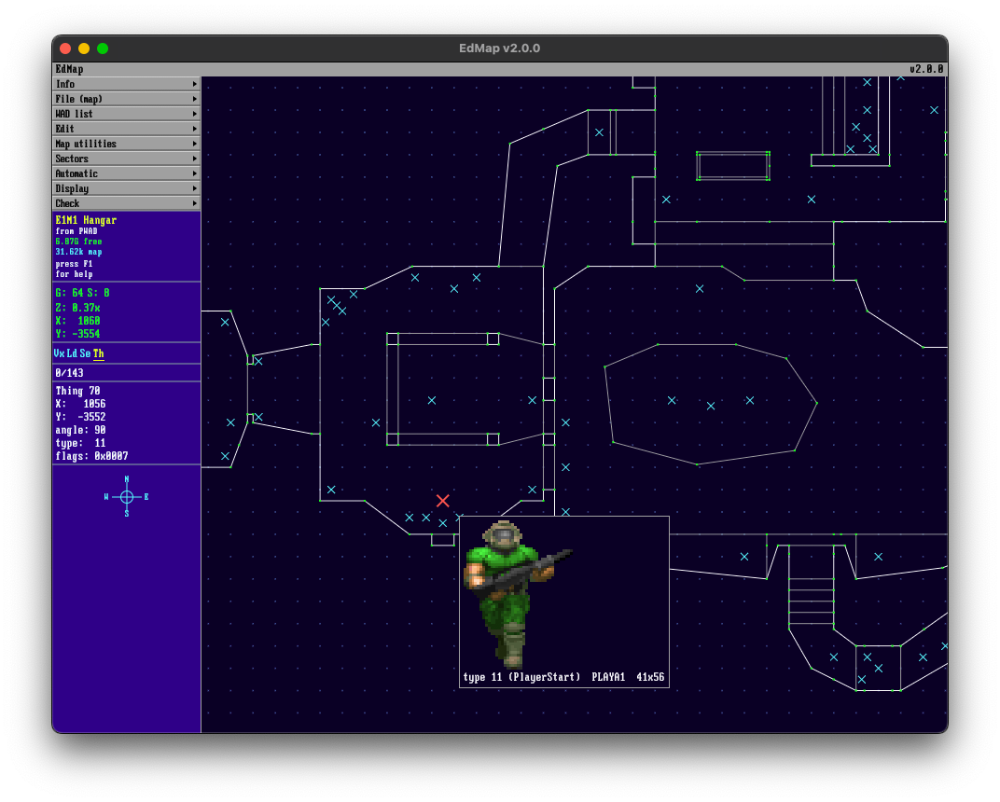

# EdMap

A Rust + egui rebuild of [Jeff Rabenhorst's EdMap v1.40](https://doomwiki.org/wiki/EdMap)
(1994 — DOOM/DOOM II/HERETIC map editor for DOS).

Written from scratch in 2026, working from the public DOOM WAD format spec,
the original `EDMAPSYS.EXE` binary's strings table, and the EdMap.txt
documentation file. Aims for visual + behavioral fidelity to the DOS original
with modern conveniences (native file pickers, Save warnings, Undo, real
texture decoding) layered on top.



A short walkthrough video is at [`screenshots/edmap2.0video.mov`](screenshots/edmap2.0video.mov)
(GitHub renders it inline; download to play locally).

```
                  EdMap
                  v2.0.0 (rebuild)

                  DOOM/DOOM2/HERETIC
                       Map Editor
```

## Status

Most original menu items are now wired. Recent additions: a software/GL 3D walk-around
view, sector style clipboard, tag-line tool, and an "Enhance map" combo cleaner.

| Area                       | Status                                                                  |
|----------------------------|-------------------------------------------------------------------------|
| WAD reader                 | Full IWAD/PWAD parse — header, directory, all 5 map lumps, PLAYPAL, PNAMES, TEXTURE1/2, F_START/END flats, S_START/END sprites |
| WAD writer                 | PWAD output: fresh-with-one-map and preserving-other-lumps modes        |
| Map view                   | Pan (right/middle drag), zoom (wheel + `+`/`-`), grid, origin marker    |
| Selection                  | Click + shift-click, hover preview, all 4 modes (Vertex/LineDef/Sector/Thing) |
| Drag-to-move               | Selected vertices/linedefs/things/sectors translate together with snap-to-grid |
| Add/split (Ins)            | Vertex insert, LineDef split, Thing insert                              |
| Backspace delete           | Thing/LineDef delete; Vertex refuses if any LineDef references it       |
| Properties (Enter)         | Per-mode dialog: Vertex / LineDef / Sector / Thing fields editable      |
| Save (F2) / Save-as        | Dirty tracking, save warning, undo from last save                       |
| Texture viewer (F10)       | Walls, Flats, Sprites — real PLAYPAL/patch-decoded pixel grids          |
| Texture picker             | Pick button on Sector floor/ceiling fields opens viewer in pick mode    |
| Map check engine           | F5 quick / Ctrl-F5 all / Ctrl-L reopen — 10 detectors with Goto-to-issue|
| Polygon construction       | Sectors > Polygon — N-gon with CCW winding                              |
| Stairs construction        | Automatic > Stairs — N rectangular sectors stacked, 4 directions        |
| Door construction          | Automatic > Door — closes selected sector + applies door-action special |
| 3D walk-around view        | Press `Q` to toggle. Real-GL renderer (`egui_glow` + `glow`) with textured walls (DOOM pegging flags), textured FLAT floors/ceilings, billboard things colored by category, fly-cam, drag-to-look, depth buffer, geometry cache, sector-hole triangulation |
| Tag line to sector         | F7 — pick a linedef, click a sector, both get a shared free tag        |
| Sector style clipboard     | Shift-F8 grab, Alt-F8 apply textures only, Ctrl-F8 apply full style    |
| Enhance map (Ctrl-E)       | One button: zero-length cleanup + missing-texture fill + unused-texture sweep |
| Find / Replace             | Ctrl-F — by linedef texture, flat, action, sector tag, thing type      |
| Map shift / expand / light | Map utilities dialogs                                                    |
| Sector Rotate / Size       | `R` / `Z` — rotate or scale selected sectors around centroid           |
| Calculator                 | Info > Calculator — DOS-style integer calculator overlay               |
| Test map                   | Ctrl-F9 — shells out to a configured source port (gzdoom / dsda-doom / etc.) |

Still missing or partial: Build & save, F1 contextual help, the auto-align
recursive walk only goes forward (not backward) and assumes 64-px texture
width. See `specs/001-edmap-nextgen/ux-spec.md` for the full menu inventory.

## Build & run

Requires Rust stable (tested on 1.78+). `cargo run` from the repo root.

Drop a TTF at `assets/`:

- `PxPlus_IBM_VGA_9x16.ttf` (preferred — VileR's pixel-perfect IBM VGA bitmap)
- or `roboto.ttf` (modern fallback)

If neither is present, egui's default proportional renders. See
`assets/README.md` for download links.

```bash
cargo run                  # debug build
cargo run --release        # release build
cargo test                 # 19 unit tests covering the WAD parser/writer,
                           # checks engine, hit-test, command primitives
```

## Controls

Mostly carried over verbatim from EdMap v1.40's keybindings. The 9-menu
sidebar is rendered live; every hotkey shown is also wired to its action.

### Map view

| Action          | Input                                    |
|-----------------|------------------------------------------|
| Pan             | Right-button drag, or middle-button drag |
| Zoom            | Mouse wheel; `+`/`-` keys                |
| Select          | Left-click on object                     |
| Multi-select    | Shift + left-click                       |
| Move selection  | Left-button drag (auto-selects on start) |
| Delete          | `BkSp`                                   |
| Add/split       | `Ins`                                    |
| Edit properties | `Enter`                                  |
| Mode switch     | `Tab` cycles, or `1`/`2`/`3`/`4`         |
| 3D view         | `Q` toggles fly-camera; WASD move, Space/E up/down, drag to look, Shift sprint |
| Cancel          | `Esc` (closes viewer / dialog / menu / cancels tag tool / exits 3D view) |

### Menu hotkeys (verbatim from EdMap v1.40)

| Key       | Action                  |
|-----------|-------------------------|
| F1        | Help (placeholder)      |
| F2        | Save map data           |
| F3        | Open map file           |
| Shift+F3  | Load PWAD map           |
| F4        | List WADs               |
| F5        | Quick check             |
| Ctrl+F5   | Check all               |
| F7        | Tag line to sector      |
| F8        | Align textures (X,Y)    |
| Shift+F8  | Grab style              |
| Ctrl+F8   | Edit styles             |
| Alt+F8    | Texture style           |
| F9        | Build & save map        |
| Alt+F9    | Alternate build         |
| Ctrl+F9   | Play map                |
| F10       | Viewer                  |
| Ctrl+E    | Enhance map             |
| Ctrl+F    | Find objects            |
| Ctrl+G    | Goto object             |
| Ctrl+L    | Error list              |
| Ctrl+O    | Origin on/off           |
| Ctrl+P    | Polygon                 |
| Ctrl+S    | Full screen             |
| Ctrl+F2   | Save as PWAD            |
| Ctrl+F4   | Add PWAD file           |
| Alt+L     | Lift                    |
| Alt+D     | Door                    |
| Alt+S     | Stairs                  |
| Alt+T     | Teleporter              |
| Alt+X     | Quit to DOS             |
| `<` / `>` | Previous / Next object  |
| `R`       | Rotate                  |
| `Z`       | Size                    |

## Project layout

```
edmap/
├── Cargo.toml / Cargo.lock      crate root is the repo root
├── EDMAP.EXE / EDMAPSYS.EXE     original DOS binaries (1994), kept for RE
├── README.md                    this file
├── assets/                      drop bgi/roboto/IBM-VGA TTFs here
├── screenshots/                 README media (PNG + walkthrough MOV)
├── edmap-decompiled/            decompiled C from the original DOS suite (for porting reference)
├── src/
│   ├── main.rs                  eframe entry
│   ├── theme.rs                 VGA palette, bevels, font loader
│   ├── wad/                     IWAD/PWAD reader + writer + texture decoder
│   │   ├── header.rs            magic + directory parse
│   │   ├── lump.rs              Wad container + map enumeration
│   │   ├── map.rs               THINGS/LINEDEFS/SIDEDEFS/VERTEXES/SECTORS records
│   │   ├── texture.rs           PLAYPAL, PNAMES, TEXTURE1/2, Patch, Flat
│   │   └── write.rs             PWAD assembly (fresh + preserve modes)
│   └── app/
│       ├── state.rs             EditorState + Dialog + ViewerCategory + 3D camera + caches
│       ├── sidebar.rs           title, menu list, MAP info, status, mode tabs, panels
│       ├── menu.rs              cascading menu rendering + handle_command dispatcher
│       ├── viewport.rs          2D map canvas: grid, vertices, lines, things, sector hover
│       ├── view3d.rs            3D walk-around: camera, geometry build, ear-clip with hole bridges
│       ├── view3d_gl.rs         GL renderer: shaders, VBOs, texture cache, depth buffer
│       ├── viewer.rs            F10 texture viewer with pick mode
│       ├── textures.rs          lazy texture cache (egui handles + raw RGBA for GL)
│       ├── map_titles.rs        canonical IWAD map titles (E1M1 "Hangar" etc.)
│       ├── dialog.rs            all modal panels (About, Edit*, Polygon, Door, etc.)
│       ├── commands.rs          every map mutation; tested
│       ├── checks.rs            map validators (no-length lines, missing exit, etc.)
│       ├── hittest.rs           point→object hit-testing for selection
│       ├── config.rs            persistent prefs (test-map exe + 3D view config)
│       ├── calculator.rs        DOS-style integer calculator overlay
│       └── keybindings.rs       global key dispatch (walks the menu spec)
└── specs/001-edmap-nextgen/
    ├── ux-spec.md               full menu tree, dialog catalog, error catalog
    └── re-notes.md              reverse-engineering log (radare2 + DOSBox-X)
```

## Differences from the original

Intentional departures, in rough order of how often they'll bite you:

- **No DOOM engine bundled.** "Play map" shells out to a configured external
  port (gzdoom, dsda-doom, etc.) — set the path + arg template under
  File (map) → Test map settings. Internal nodes-builder for "Build & save"
  is still placeholder; a node builder runs at PWAD-build time when needed.
- **3D view is editor-side, not a play preview.** Q toggles a fly-camera with
  textured walls/floors/ceilings and thing markers, useful for spotting
  height/texture mistakes without leaving the editor.
- **No 16-bit XMS / disk swapping.** Modern OSes have plenty of RAM.
- **Native file dialogs** via `rfd` instead of the home-brewed in-app file
  picker. Faster, integrates with macOS/Linux/Windows file systems.
- **No `MOUSEPIC.DAT`** — the OS owns the cursor.
- **Auto-snap differences.** Drag uses a residual accumulator so very slow
  drags still register motion across frames; the original used pixel-step.
- **Stairs and Polygon don't weld duplicate vertices.** A node builder
  cleans this up at PWAD-build time, but the in-memory geometry is denser
  than EdMap's would be. A future `weld_duplicates` pass will fix it.

## Reverse-engineering notes

`specs/001-edmap-nextgen/re-notes.md` documents the radare2 + DOSBox-X
workflow and what we've found in `EDMAPSYS.EXE`:

- Borland Turbo Pascal MZ build, single `.text` segment carries code +
  Pascal length-prefixed strings. DGROUP base ≈ vaddr `0xCD8E`.
- The LineDef-check function chain: `fcn.0001584c` (iter scaffold) →
  `fcn.00016248` (per-line inspector) → `fcn.00015d9e` (error display).
- The exact "long LineDef" warning threshold is still unverified — our
  approximation is 1024 units. To pin it precisely, run EdMap in DOSBox-X
  with a stub PWAD and bisect.

## Original credits

EdMap v1.40 — Jeff Rabenhorst (araya@wam.umd.edu), 1994. Distributed free,
no registration. The original is included in this repo as `EDMAP.EXE` and
`EDMAPSYS.EXE` for RE reference; full source has never been released.

DOOM, DOOM II, and HERETIC are trademarks of id Software / Raven Software.
This rebuild produces PWADs in the standard format and is not affiliated
with id, Raven, ZeniMax, or Bethesda.

## License

The Rust rebuild source code in `src/` is dedicated to the public domain
(unless overridden by a future LICENSE file). Bundled asset TTFs carry
their own licenses — see `src/assets/README.md`. The original 1994 EdMap
binaries are unmodified and redistributed under their original
"completely free; no registration required" terms.
